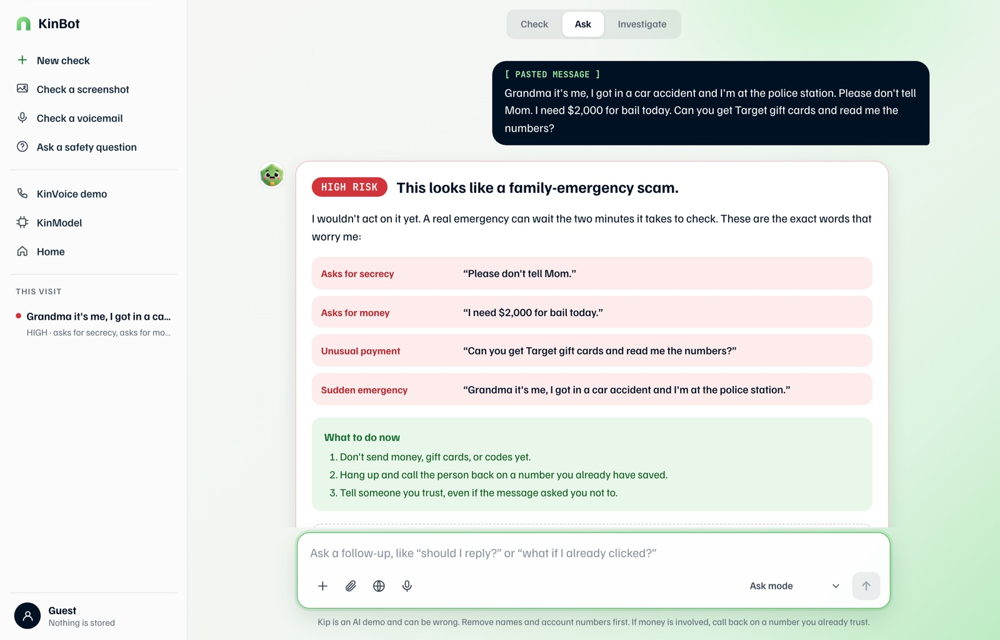
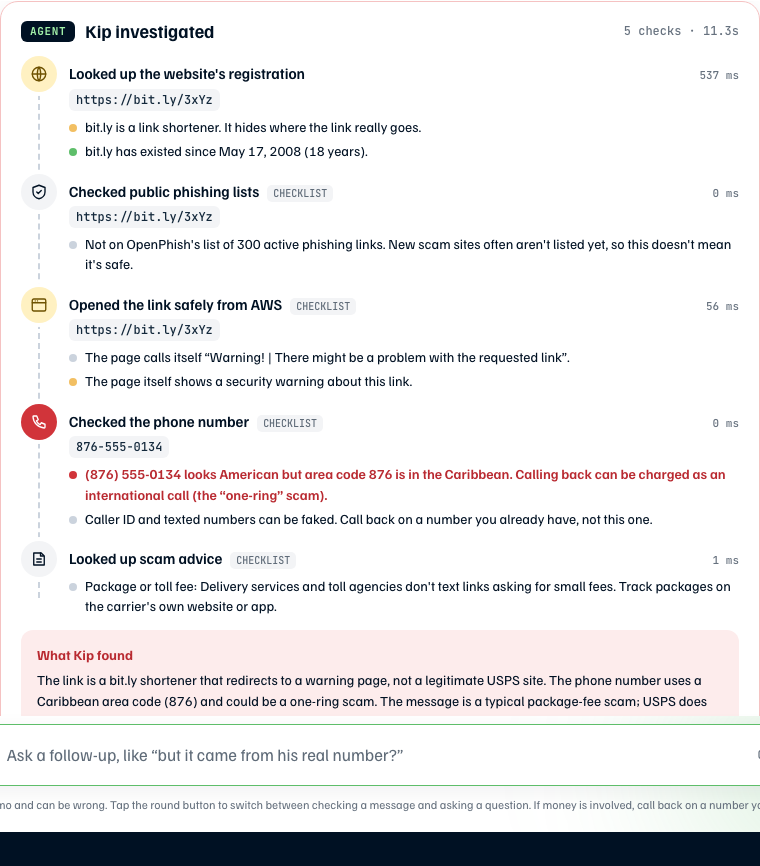

# KinShield

**Category:** `#daily-life-enhancement` · **Lane:** `#startup`
**Live on AWS:** **https://kinshield.site** (public, no login needed) · **Coding agents:** Kiro + Claude Code, both operating the AWS account through the AWS CLI

> Existing scam protection asks whether an unknown caller looks suspicious. KinShield asks whether a trusted conversation has become dangerous.

_Last updated 2026-10-04. Full history: [PROGRESS.md](PROGRESS.md). Long-form write-up: [docs/WRITEUP.md](docs/WRITEUP.md). Coding-agent evidence: [docs/evidence/](docs/evidence/)._

**Contents:** [The gap](#the-gap) · [What is live](#what-is-live-all-on-aws-no-login) · [How to use KinShield](#how-to-use-kinshield) · [Results](#results-measured-on-the-live-api) · [Architecture](#architecture-and-decisions) · [Proof the coding agents operated AWS](#proof-the-coding-agents-operated-aws) · [Debugging stories](#debugging-stories) · [Who it's for](#who-its-for-and-the-business-model) · [Honest limits](#honest-limits) · [API](#api-kinshield-detector-lambda-behind-api-gateway-http-api) · [Layout and deploy](#layout)

## The gap
Elder fraud is large and growing. FBI IC3's 2025 report counts more than 201,000 complaints from people over 60 and more than $7.7B lost, up 59%. The grandparent scam follows a known script: a panicked "relative" claims an arrest or accident, asks for secrecy, then asks for payment by wire or gift cards.

Voice cloning makes the voice and caller ID look right. Google and Samsung's on-device Scam Detection is real and shipped. By their own documentation it is opt-in, off by default, and not used on calls from your contacts. It protects the device owner from strangers. It does nothing for a grandparent whose phone shows a trusted number (or a cloned voice) and who will never enable a setting.

KinShield is delegated protection: a caregiver sets it up once, for a parent who does nothing. It detects the *behaviour* of a dangerous conversation (impersonation, manufactured emergency, secrecy, payment escalation, authority pressure, urgency), not the voice, so it works even against a perfect clone. It never gives a bare percentage: every warning quotes the exact words that triggered it.

## What is live (all on AWS, no login)

KinShield is the umbrella brand. The site has a hub page and three products, all built on the same seven-signal detector.

| Page | What it does |
|---|---|
| [`/`](https://kinshield.site): hub | Introduces the products ("One family. Two ways to keep watch."), how it runs on AWS, honest notes, planned pricing and the Android beta download. |
| [`kinvoice.html`](https://kinshield.site/kinvoice.html) + [`kinvoice-app.html`](https://kinshield.site/kinvoice-app.html): **KinVoice** | Call demo. Plays a scripted call and re-scores it with Amazon Bedrock after every caller turn: risk timeline, cited evidence, a mid-call alert, a simulated "Verify with family" step and a fraud report. You can also type, paste or dictate your own call. 63 scenarios. |
| [`kinbot.html`](https://kinshield.site/kinbot.html) + [`kinbot-chat.html`](https://kinshield.site/kinbot-chat.html): **KinBot** | Check a text, email, call script, **screenshot** (read by a vision model) or **voicemail** (transcribed by an audio model). Every warning sign is quoted from your own text. Then an **investigator agent** checks the links and phone numbers. Ask mode answers follow-up safety questions. Optional sign-in saves a summary of each check. |
| [`kinmodel.html`](https://kinshield.site/kinmodel.html): **KinModel** | Scores one message two ways: KinShield-Lite (a 119 KB int8 TF-IDF + logistic-regression model running inside the Lambda) next to the Bedrock detector, and shows whether they agree. Also documents our gpt-oss-20b fine-tune research. |
| "Ask Kip" help widget | On the hub and product info pages. Answers only from a written knowledge base (`lambda/evidence-detector/kb.md`) and cites its source. If someone says a scam is happening now, or that they already paid, it skips the model and shows a fixed safety card. |



**URLs**
- Site + API (HTTPS): **https://kinshield.site** (also `www.`). An API Gateway regional custom domain with an ACM certificate and Route 53 DNS. The Lambda serves the pages and the API from the same origin.
- Same app on the raw API URL: `https://zx9d4nrkni.execute-api.us-east-1.amazonaws.com`. The older S3 static website (HTTP, account ID in the hostname) is still deployed but isn't linked.
- Separate experiment, not used by the site: KinShield-Tiny v3 (a distilled MiniLM-L6, int8 ONNX) on its own stack `kinshield-tiny-ml`. See `../kinshield-tiny/`.

---

## How to use KinShield

Everything below works in a normal browser at **https://kinshield.site** with no account, no install and no phone call. Phones work too; the layouts adapt down to 390px wide.

### Quick start (3 minutes)
1. Open **https://kinshield.site/kinvoice-app.html?run=scam**. A scam call starts playing straight away. Wait about 30 seconds and the HIGH-risk alert appears.
2. Open **https://kinshield.site/kinbot-chat.html?example=0**. KinBot checks a "grandson in jail" text and shows High risk with the exact quotes, then the investigator agent runs.
3. Open **https://kinshield.site/kinmodel.html**, press **Grandson in jail** under "Try an example:", and see the small model and the Bedrock detector score it side by side.

### KinVoice: watch a trusted call turn dangerous
Open **KinVoice** from the hub, then **Try a scam call**, or go straight to `kinvoice-app.html`.

1. **(Optional) Set up the family.** Press **Set up** in the sidebar. Enter the protected person (default "Mom"), your name as caregiver, up to three trusted contacts, the alert level (High, or Medium and above) and an optional family safe word. This is saved only in your browser and the names appear throughout the demo.
2. **Pick a call.** The **Calls** tab lists all 63 scripted calls. Search them, or filter with **Scam / Safe / All**. In the sidebar, **Random scam call** always picks a scam that reliably scores HIGH; **New call** starts again.
3. **Watch it play.** The **Live call** tab shows the transcript on the left. After each caller turn, the page sends the conversation so far to the Bedrock detector (at most 6 scores per call). The risk meter and the **risk timeline** rise only when the evidence adds up. A greeting alone scores LOW; a greeting plus an emergency, secrecy and a gift-card request scores HIGH.
4. **Read the evidence.** Each warning sign shows its signal name (for example *Secrecy*), the exact line it came from and its timestamp. The lead line under the timeline says when the alert fired, for example "Alert at 00:18 (turn 4 of 6) · on the line that asked for money".
5. **Get the alert.** When the score first crosses your alert level, a push-style toast appears mid-call. At the end of the call, the alert dialog shows the three strongest quotes.
6. **Verify with family.** Press **Verify with family**. A simulated message goes to the matching trusted contact ("Did that call really come from family?"). Answer **No, it wasn't me** to see the "caller not verified" result, or **Yes, it was me**. This step is simulated and labelled that way.
7. **Make a report.** Press **Fraud report** to copy it or download it as a .txt file. It lists the caller's claim, the likely scam type, every money ask with its time, every quoted sign, the full transcript, and where to report: FTC, FBI IC3 and the DOJ Elder Fraud Hotline (1-833-372-8311). Scripted calls are marked "practice only".
8. **Hear it.** Switch **Voice off** to on, and Amazon Polly reads the caller's lines aloud while your browser reads the other side.
9. **Test your own call.** Open the **Your call** tab (or `kinvoice-app.html?own=1`). Add lines as **Caller** or as the protected person by typing, using the microphone (Chrome, Edge or Safari), or pasting a whole conversation as `Name: line` rows. **Start from a scripted call** loads one to edit. Press **Run through KinVoice** to score it the same way.
10. **Review.** The **Alerts** tab and the sidebar's history list every call you played in this visit.

Also try a safe call: the hard negatives include a real $100 loan for a plumber and a "don't tell Dad, it's a surprise party" secret. Both should stay LOW.

### KinBot: check a message, screenshot or voicemail
Open **KinBot** from the hub, then **Open KinBot**, or go straight to `kinbot-chat.html`. A welcome popup appears on the first visit. **Continue as guest** gives you every feature.

1. **Check a message.** Paste a text, email or call script (up to 2,000 characters) into the box. Make sure the mode is **Check**, then send. Or press one of the quick-start cards (**Check a message**, **Grandson in jail**, **Ask a safety question**, **Already sent money?**) or an example chip under "More examples:".
2. **Read the verdict.** You get a badge (High risk / Be careful / Looks safe), a one-line headline, "Why Kip is worried" with each warning sign quoted from *your* text, and a numbered "What to do now". Quotes that aren't really in your text are removed by the server before you see them. Open **How Kip checked this** to see the model and the KinModel-Lite score.
3. **Let the agent investigate.** Straight after the verdict, the investigator agent checks every link and phone number in the message: who owns the website and how old it is, brand look-alike domains, a phishing feed (OpenPhish), a guarded fetch of the page (no JavaScript, cookies or forms), phone-number patterns (one-ring area codes, 900 numbers) and scam guidance from the FTC. It shows its conclusion and a **Next step** first, then each check with a Danger / Caution / Note label. You can also switch to the **Investigate** tab.
4. **Kip's overall take.** If the agent finds danger that the text check missed (for example a fake USPS fee link), an **Overall** card raises the verdict. It can raise the verdict, never lower it.
5. **Check a screenshot.** Press **+** or the attach button, choose **Check a screenshot**, then pick an image, paste one with Ctrl/Cmd+V or drag it in. The vision model reads the visible text, the brand, any QR code and visual warning signs, shows "What Kip read", then runs the same check and investigation. It takes about 8 seconds.
6. **Check a voicemail.** Choose **Check a voicemail** and upload a recording, or press the mic to record (up to about 110 seconds). The audio model transcribes it in the original language, shows "What Kip heard", then checks it.
7. **Ask a follow-up.** Switch the mode to **Ask** (or press a follow-up chip such as **Copy a call-back script**) and ask a safety question. If you write that you already sent money or that it's happening right now, KinBot shows a fixed safety card with the next steps instead of a model answer.
8. **(Optional) Sign in.** **Sign in to save history** opens a hosted sign-in page (email and a verification code). Signed-in users see "Your checks" in the sidebar. Only the risk level, type, headline, score and date are saved, never the message, for 90 days. The account view has **Delete my history** and **Sign out**.
9. **Get started guide.** The **Get started** pill in the corner walks through six steps (check, investigate, ask, screenshot, voicemail, open KinVoice) and ticks them off as you go.

### KinModel: a second opinion
1. Open `kinmodel.html` and scroll to **Score a message, two ways**.
2. Paste a message (up to 2,000 characters), or press **Grandson in jail**, **Fake USPS fee**, **"Social Security officer"** or **Real pharmacy text**.
3. On the left, KinModel-Lite gives a probability and "scam-like / not scam-like". On the right, the Bedrock detector gives a level, a score and the top three quotes. A line underneath says whether they agree.
4. Read **The numbers, and why to doubt them** and **We fine-tuned gpt-oss-20b, then shrank it again** for the research behind it.

### Ask Kip (help widget)
On the hub, KinVoice, KinBot and KinModel info pages, press **Questions? Ask Kip** in the bottom corner. Pick a common question or type your own. Each answer shows its **Source** from the knowledge base.

### Android beta (optional)
The hub's **Android beta** section links a 2.3 MB APK (KinShield Beta 0.1.0). It runs KinBot, share-to-KinBot, offline KinModel-Lite and the KinVoice demo. It's sideloaded, so Play Protect may warn you. It is a beta made after the hackathon deadline and isn't part of the submission.

### What is real and what is simulated
| Real (live on AWS) | Simulated (labelled in the UI) |
|---|---|
| Bedrock scoring of every call turn and message | Phone calls: KinVoice plays scripted or typed transcripts, not live audio |
| Quotes checked against your text | "Verify with family" and the location check |
| The investigator agent's tool checks | Push alerts (shown in the page, not sent to a phone) |
| Screenshot reading, voicemail transcription, Polly voice | Pricing (planned, nobody pays) |
| Sign-in and saved history (Cognito + DynamoDB) | Google sign-in (configured but off) |

---

## Results (measured on the live API)

**Call detector, 63 scenarios** (31 scam, 32 safe), run against `https://kinshield.site` on 2026-10-03 05:30 UTC ([benchmark/RESULTS.md](benchmark/RESULTS.md)):

| Metric | Value |
|---|---|
| Scams flagged MEDIUM/HIGH | **93.5% (29/31)** |
| Safe calls raising an alarm | **0% (0/32)** |
| Safe calls with zero evidence | 96.9% (31/32) |
| Evidence-signal recall (mean over scams) | 75.6% |
| Latency median / p90 / max | 798 ms / 2,999 ms / 5,644 ms |

The two misses: `scam_010` scored 24, one point under the MEDIUM line, and `scam_024` scored 18.

**KinBot, 46 messages** (29 scam, 17 legit; [eval/kinbot/REPORT.md](eval/kinbot/REPORT.md)). This is the weaker result, and we show it:

| | Recall | False alarms on legit |
|---|---|---|
| Text check alone | 31% (9/29) | 0/17 |
| Check + agent (danger) | **69% (20/29)** | 1/17 |

The text check is tuned to the family-emergency call script, so it scores many delivery, toll and billing texts LOW. The agent catches 11 of those from their links and phone numbers. That is why KinBot always runs both, and why the overall take can only raise the verdict.

**Fine-tune research, 63 held-out calls** (details in [docs/WRITEUP.md](docs/WRITEUP.md#how-we-trained-the-models)):

| Model | Correct | Safe calls flagged |
|---|---|---|
| gpt-oss-20b, stock (live) | 61/63 | 0/32 |
| gpt-oss-120b, stock | 62/63 | 0/32 |
| gpt-oss-20b + our QLoRA (DGX Spark) | 62/63 | 0/32 |
| KinShield-Tiny v3 (MiniLM-L6, distilled) | 60/63 | 0/32 |

**Read these honestly.** The scenarios were written by us from cited FTC and FBI IC3 patterns (`benchmark/sources.md`), not recorded from real calls, and the prompt was tuned on the same family of scripts. One call is about 1.6 points. They show the system works as designed; they are not field accuracy. The live app still uses stock gpt-oss-20b: the LoRA model takes about 5 s per call, and this account has no GPU quota to host it on AWS.

## Detector output contract (never a bare percentage)
```json
{
  "risk_level": "HIGH",
  "evidence": [
    {"t": "00:04", "quote": "Grandma, it's me.", "signal": "impersonation", "weight": 20},
    {"t": "00:18", "quote": "Don't tell Mom.", "signal": "secrecy", "weight": 30},
    {"t": "00:34", "quote": "Buy gift cards.", "signal": "payment_anomaly", "weight": 30}
  ],
  "risk_score": 80,
  "recommended_action": "End the call. Independently contact the family member using a number you already have saved."
}
```
Signal taxonomy (fixed; each signal is cited to an FTC/IC3 pattern in `benchmark/sources.md`): impersonation, emergency, secrecy, financial_request, payment_anomaly, authority_pressure, unusual_urgency. The server recomputes the score from the weights, re-derives the level (LOW 0–24, MEDIUM 25–59, HIGH 60+), drops unknown signals, caps a lone signal at 10, and picks the recommended action in code.

## Architecture and decisions

```
Browser ──HTTPS──▶ kinshield.site (Route 53 + ACM, API Gateway regional custom domain)
                        │
                        ▼
              API Gateway HTTP API ──JWT authorizer (Cognito)──▶ /history
                        │
                        ▼
          Lambda "kinshield-detector" (Python 3.12)
           ├─ serves the static pages (same origin as the API)
           ├─ /detect, /kinbot check ──▶ Bedrock Mantle: openai.gpt-oss-20b
           ├─ /kinbot investigate ─────▶ gpt-oss-20b function calling + read-only tools
           ├─ /kinbot screenshot ──────▶ Bedrock Mantle: qwen.qwen3-vl-235b-a22b-instruct
           ├─ /kinbot voicemail ───────▶ Bedrock Mantle: mistral.voxtral-small-24b-2507
           ├─ /kinbot speak ───────────▶ Amazon Polly
           ├─ /chat (Ask Kip) ─────────▶ gpt-oss-20b, grounded in kb.md
           ├─ KinModel-Lite (in-process, no model call)
           ├─ Secrets Manager (Bedrock API key) · DynamoDB (demo sessions, opt-in history)
           └─ CloudWatch Logs
```

**AWS services used:** AWS Lambda, Amazon API Gateway (HTTP API, custom domain, JWT authorizer), Amazon Bedrock (Mantle endpoint: gpt-oss-20b, gpt-oss-120b for labelling, Qwen3-VL, Voxtral), Amazon Polly, Amazon Cognito, Amazon DynamoDB, AWS Secrets Manager, Amazon Route 53, AWS Certificate Manager, AWS CloudFormation, Amazon CloudWatch, AWS Budgets, and Amazon S3 (the older static site). Amazon Textract and Amazon Transcribe are **not** enabled on this account and aren't used.

**Four decisions:**
1. **Signals over voice.** Voice-clone detection is an arms race. A behavioural taxonomy looks at what a scam script has to make the victim believe and do, which doesn't depend on how good the clone is.
2. **Evidence, never a bare score.** Quoting the line makes a warning actionable. In KinBot the server drops any quote that isn't in the user's own text.
3. **Don't trust the model's arithmetic.** `_normalise()` recomputes the score from the evidence weights, re-derives the level from fixed thresholds, drops unknown signals and caps a lone signal. The recommended action is chosen in code.
4. **The agent may reason but not invent.** Every finding the investigator shows comes from tool output. `visit_page` returns extracted features (forms, password fields, redirects, brand mentions), never page text, so a scam page can't inject instructions. If the model skips a required check, a deterministic checklist runs it. The loop is capped at 5 model turns, 7 tool calls and 22 s, inside API Gateway's 30 s limit.

## Proof the coding agents operated AWS

**Kiro** drove Days 0–2 (Sep 28–30): the spec in [`.kiro/specs/kinshield/`](.kiro/specs/kinshield/) (requirements, design, tasks), account discovery, the first CloudFormation deploys and the first benchmark. **Claude Code** did everything from Sep 30 on: KinBot and its agent, screenshots and voicemail, KinModel, the hub, sign-in, the custom domain, every redeploy, and live checks with Playwright at three screen widths after each deploy. Both ran the AWS CLI as IAM user `kiro`. The full index is [docs/evidence/README.md](docs/evidence/README.md). Account IDs are redacted.

**1. Identity, checked by the agent** ([`readonly-aws-evidence-2026-09-30.log`](docs/evidence/readonly-aws-evidence-2026-09-30.log)):
```
## sts get-caller-identity
{
    "UserId": "<IAM_USER_ID>",
    "Account": "<ACCOUNT_ID>",
    "Arn": "arn:aws:iam::<ACCOUNT_ID>:user/kiro"
}
```

**2. Day 0: the agent found why Bedrock refused every model** ([`day0-capture.log`](docs/evidence/day0-capture.log)):
```
### bedrock-runtime Converse (BLOCKED path) ###
An error occurred (ValidationException) when calling the Converse operation: Operation not allowed

### Mantle /v1/chat/completions (WORKING path) ###
{"choices":[{"message":{"content":"KINSHIELD_OK", ...}}],"model":"openai.gpt-oss-120b", ...}
[http=200]
```

**3. Day 1: the agent deployed the backend stack and tested it live** ([`day1-backend-deploy.log`](docs/evidence/day1-backend-deploy.log)):
```
|  kinshield-backend|  UPDATE_COMPLETE  |  2026-09-29T10:20:08.864000+00:00  |
|  DetectorFunction   |  CREATE_COMPLETE  |  AWS::Lambda::Function           |
|  HttpApi            |  CREATE_COMPLETE  |  AWS::ApiGatewayV2::Api          |
|  SessionTable       |  CREATE_COMPLETE  |  AWS::DynamoDB::Table            |

### public API health ###
{"status": "ok", "service": "kinshield-detector", "model": "openai.gpt-oss-120b"}
[http=200]
### live detect: scam_001 (HIGH) ###
{"risk_level": "HIGH", "risk_score": 120, "evidence": [ ...6 quoted signals... ]}
### live detect: benign_001 (LOW, zero evidence) ###
{"risk_level": "LOW", "risk_score": 0, "evidence": []}
```

**4. CloudTrail: which client made the calls** (same log, 2026-09-30, latest 50 events for user `kiro`):
```
43 events userAgent aws-cli/2.34.3 (AWS CLI, run from the agent's shell)
 7 events userAgent lambda.amazonaws.com (service-initiated)
 0 events with userAgent/sourceIPAddress aws-mcp.amazonaws.com
```
We didn't use the AWS MCP Server and don't claim to.

**5. Day 4: the agent redeployed and checked the live files and API** ([`day4-uxfixes-verify.log`](docs/evidence/day4-uxfixes-verify.log)):
```
=== /detect scam_001 (expect HIGH, cited evidence) ===
[http=200 latency=4.441186s]
risk_level: HIGH score: 126 evidence: 6
=== /detect benign_005 (birthday-surprise secret; expect LOW, no false positive) ===
[http=200 latency=1.796040s]
risk_level: LOW score: 0 evidence: 0
```

**6. Oct 2: KinBot shipped** ([`kinbot-ship-2026-10-02.md`](docs/evidence/kinbot-ship-2026-10-02.md)): Lambda code update, S3 sync, smoke tests and Playwright checks of the live site. Below is the live investigator agent at that time:



## Debugging stories
- **Bedrock said "Operation not allowed" for every model.** Converse and InvokeModel failed for Nova, Llama and Claude with every credential type. The agent ruled out SCPs, model access and IAM, then found the account was provisioned on Bedrock's **Mantle** endpoint (OpenAI-compatible, API key as a bearer token). Mantle rejected Anthropic models, so we use `openai.gpt-oss-*`.
- **The Bedrock API key expired during the deadline day.** Every model call returned 401 while `/health` still said "ok". We rotated the key, made `/health` run a real model call, and made any 401/403 clear the cached key so a rotated secret is picked up without a redeploy.
- **The voicemail model translated instead of transcribing.** With a vague prompt, Voxtral turned an English voicemail into German, and a system message made it return HTTP errors. The working prompt sends the audio first, then "same language… do not translate".
- **A birthday secret scored MEDIUM** (secrecy weighs 25–30). The fix was a prompt rule plus a server-side cap on a lone signal. Scam recall didn't change.
- **gpt-oss leaked `<|channel|>` tokens into tool names.** The agent loop cleans the names, and the deterministic checklist covers any check the model skips.
- **AgentCore Browser was planned, and its quota was 0.** The account's browser-session quota is applied at 0 and Service Quotas rejects increases at or below the default, so it needs AWS Support. We built a guarded static fetch instead and describe it as exactly that.
- **Lambda Function URL returned 403 with zero logs, and CloudFront was refused** ("account must be verified"). We put API Gateway in front, and later gave it a custom domain with ACM, which also removed the account ID from the public URL.
- **The account allows only 10 concurrent Lambda executions in total.** The Tiny experiment's stack asked for reserved concurrency and failed. The agent rolled it back and redeployed it behind a throttled HTTP API, so traffic to the experiment can't starve the live detector.
- **Our own deploy once published test screenshots.** The frontend sync uploads everything in `web/src/`. The agent deleted them from S3, and test runs now write to a scratch folder.

## Who it's for and the business model
- **The user is the caregiver, not the parent.** An adult child sets KinShield up once for a parent who changes nothing about their day. That is a different buyer from a device owner protecting themselves, which is who the built-in phone features serve.
- **Planned price:** one plan, **KinShield Family, $5–10 a month per protected person**, covering KinVoice and KinBot. It is labelled "planned · not live" on the site ([kinshield.site/#pricing](https://kinshield.site/#pricing)). Later: a plan for several protected people, and plans for organisations that serve older adults.
- **Where it stands:** pre-launch. No users, no revenue, and no caregiver interviews yet. We make no market-size claim; the claim is the gap above.
- **First users:** a small, consent-based pilot with caregivers of older adults, measuring false alarms, time to the first HIGH alert, and whether the quoted evidence helps a family decide what to do.
- **Roadmap:**
  1. Live calls: a real number through the Amazon Chime SDK, with live transcription feeding the same detector.
  2. Real caregiver push alerts and real family verification (both simulated today).
  3. Better text-scam coverage, since KinBot's 69% recall is the weakest number above.
  4. Evaluation on data we didn't write.
  5. KinModel as an on-device pre-filter or offline fallback, once validated.

## Honest limits
- The test scenarios and KinBot messages were written by us, and the prompt was tuned on the same family of scripts.
- Evidence-signal recall is about 76%: verdicts are mostly right, but individual signals are sometimes missed.
- KinBot catches 69% of the scam texts in our set. Delivery, toll and job-offer scams are its weak spot.
- Everything is text, screenshots or recordings. There is no live telephony, and nothing has been tested on real calls, accents or noisy audio.
- The API has no rate limit, and the account allows 10 concurrent Lambda executions, so heavy simultaneous traffic could see errors.
- No caregivers or parents have tested it yet.
- There is no AWS MCP Server evidence (see above).

## API (`kinshield-detector` Lambda behind API Gateway HTTP API)
| Route | Purpose |
|---|---|
| `GET /health` | Service, model id, and a real model probe (`model_ok`; cached 5 min, 503 if it fails) |
| `GET /scenarios`, `GET /scenario?id=` | KinVoice demo scenarios |
| `POST /detect` | Score a scenario, turns or transcript |
| `POST /chat` | Ask Kip support bot (grounded in `kb.md`, deterministic safety routing) |
| `POST /kinbot` `mode:"check"` | Score pasted text (≤2,000 chars). Quotes not found in the text are dropped. Includes the Lite score. |
| `POST /kinbot` `mode:"ask"` | Follow-up safety question (≤500 chars) |
| `POST /kinbot` `mode:"investigate"` | Investigator agent: a gpt-oss-20b function-calling loop (≤5 turns, ≤7 tools, 22 s budget) over read-only tools `inspect_link`, `check_threat_feeds`, `visit_page` (guarded static fetch, not a browser), `check_phone` and `lookup_guidance` |
| `POST /kinbot` `mode:"screenshot"` | Reads a screenshot with `qwen.qwen3-vl-235b-a22b-instruct` on Bedrock Mantle: visible text, brand, QR code and visual warning signs |
| `POST /kinbot` `mode:"voicemail"` | Transcribes a WAV recording with `mistral.voxtral-small-24b-2507` on Bedrock Mantle |
| `POST /kinbot` `mode:"speak"` | Amazon Polly reads caller lines aloud in the KinVoice demo |
| `POST /kinbot` `mode:"ocr" / "voicemail_start" / "voicemail_status"` | Textract and Transcribe paths in `media.py`. Those services aren't enabled on this account, so no page uses them |
| `GET / POST / DELETE /history` | Saved check history for signed-in users (Cognito JWT authorizer) |

Messages, screenshots and voicemails aren't logged or stored; audio goes straight to the model. Sign-in is optional. Signed-in users get a saved summary of each check (risk level, type, headline, score and date, never the message) in DynamoDB `kinshield-history` for 90 days, and they can delete it from the account view.

## Not built
Real phone calls (Chime SDK PSTN), live audio transcription of calls, caregiver push notifications to a real phone, real family verification (FamilyVerify is simulated), Google sign-in (configured but off), and messaging-app monitoring.

## Layout
```
benchmark/        63 synthetic scenarios (31 scam / 32 benign), generators, runner, RESULTS.md, sources.md
lambda/evidence-detector/
  handler.py      routes, detector, /chat, /kinbot, safety routing, static file server
  agent.py        KinBot investigator agent + tools
  lite.py, lite_model.json   KinShield-Lite (pure-Python int8 scorer)
  media.py        Polly (used); Textract / Transcribe helpers (not enabled on this account)
  prompt.md, kb.md
infra/            CloudFormation templates (backend, frontend-s3, auth) + deploy scripts
web/src/          index, kinvoice, kinvoice-app, kinbot, kinbot-chat, kinmodel pages; kinvoice-app.js, kinbot-app.js, kinbot-guide.js, kinmodel.js, chat.js, guide.js, ui.js; styles
android/          KinShield Beta (Kotlin + Jetpack Compose), built after the deadline
eval/kinbot/      46-message KinBot eval set, runner and REPORT.md
docs/             WRITEUP.md, evidence/ (redacted agent + AWS evidence)
.kiro/specs/      Kiro requirements / design / tasks
```

## Deploy
```bash
infra/deploy_backend.sh        # Lambda code (bundles all of web/src/) + backend stack, smoke-tests /health
infra/deploy_frontend_s3.sh    # syncs ALL of web/src/ to the older S3 site (with --delete), smoke-tests index.html
```
Both scripts publish everything in `web/src/`. Keep test screenshots and scratch files out of that folder.
