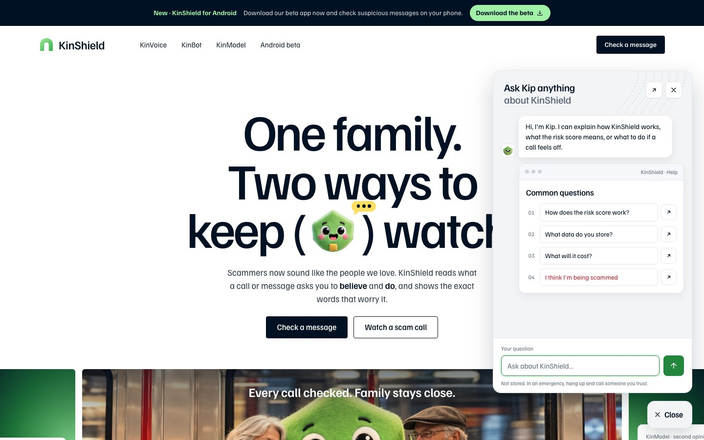
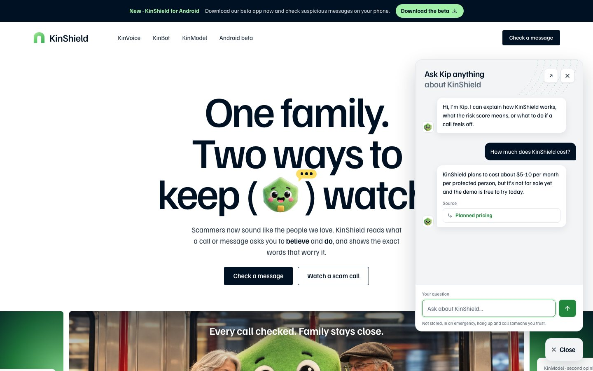

<h1 align="center">Ask Kip guide</h1>

<b>Questions about KinShield, answered from a written source.</b> 
<a href="https://kinshield.site/">Open KinShield</a> · <a href="../../README.md">Back to the KinShield README</a>

---

Ask Kip is the help widget on the KinShield info pages: the home page, KinVoice, KinBot and KinModel. It answers questions about KinShield, scam warning signs and what to do after a scam, **only** from a written knowledge base, and shows which section each answer came from.

## How to use it
1. Press **Questions? Ask Kip** in the bottom-right corner of any info page.
2. Pick one of the **Common questions**, or type your own and press send.

   

3. Read the answer. The **Source** under it names the knowledge-base section it came from (for example *Planned pricing*).

   

4. Press ↗ to open KinBot if you want to check a real message, or ✕ to close.

## Safety first
If you write that a scam is happening **right now**, or that you've **already sent money**, Ask Kip doesn't call the AI model at all. It shows fixed, numbered safety steps, such as hanging up, calling your bank and where to report.

## Privacy and limits
- Messages aren't stored. In an emergency, hang up and call someone you trust.
- Ask Kip only knows what's in its knowledge base (`lambda/evidence-detector/kb.md`). It doesn't check messages; KinBot does that.
