

<h1 align="center">KinBot guide</h1>

<b>Strange message? Ask KinBot before you pay.</b> 
<a href="https://kinshield.site/kinbot-chat.html">Open KinBot</a> · <a href="../../README.md">Back to the KinShield README</a>

---

KinBot checks a suspicious **text, email, call script, screenshot or voicemail**. It tells you how risky it looks, quotes the exact words that worried it, and says what to do next. Then an investigator agent checks every link and phone number in it. You can ask follow-up questions too.

**You need:** a browser. No account is needed; sign-in is optional and only saves a short history.

## 1. Open KinBot
The info page **https://kinshield.site/kinbot.html** explains KinBot and shows a frozen example of a real check. Press **Open KinBot** to go to the app.

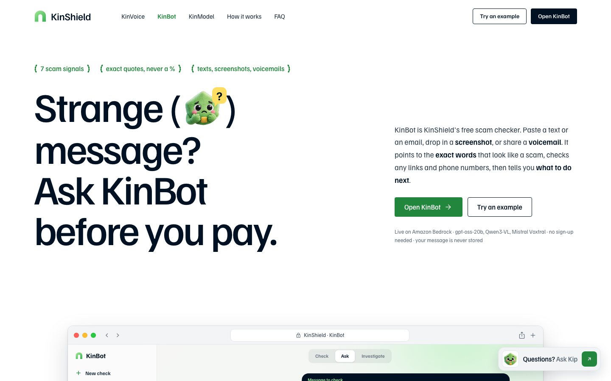

## 2. Welcome popup
On your first visit, a welcome popup explains the three steps: paste it, Kip finds the warning signs, call back on a number you trust. Press **Continue as guest** to use every feature, or **Sign in with email** to save a history of your checks.

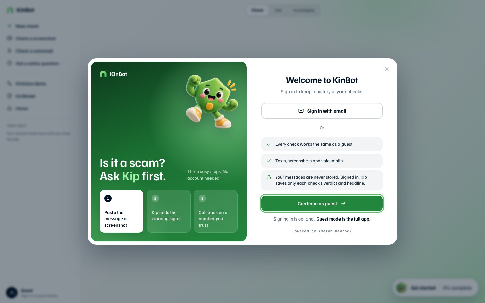

## 3. The home screen
- **Composer:** paste text here, or use the buttons under it: **+** (more options), the paperclip (attach a screenshot or recording), the globe (check a link) and the microphone (record a voicemail).
- **Mode:** *Check mode* checks a message; *Ask mode* answers a safety question.
- **Try an example:** four quick-start cards (**Check a message**, **Grandson in jail**, **Check a screenshot**, **Already sent money?**) and more example chips.
- **Sidebar:** New check, Check a screenshot, Check a voicemail, Ask a safety question, and links to KinVoice, KinModel and Home.

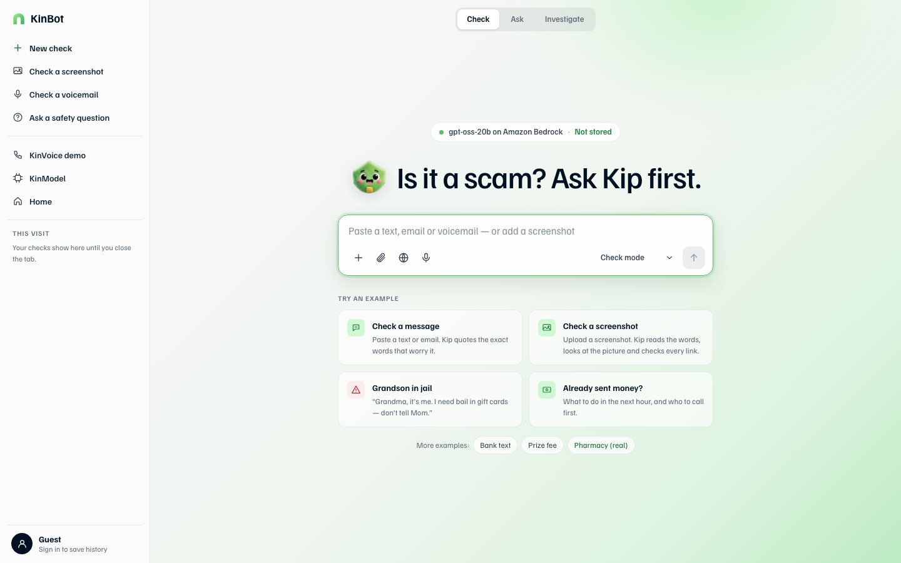

A **Get started** checklist opens in the corner on a wide screen. It walks you through six steps (check, investigate, ask, screenshot, voicemail, open KinVoice) and ticks them off as you go. Fold it away with **Hide checklist**.

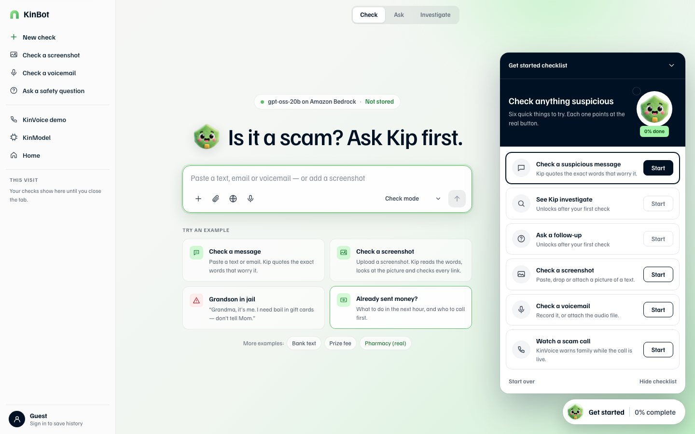

## 4. Check a message
Paste a text, email or call script (up to 2,000 characters) and press the send arrow, or press **Grandson in jail** to try one. The link `kinbot-chat.html?example=0` runs that example straight away.

The verdict shows:
- a badge (**High risk**, **Be careful** or **Looks safe**), a headline and one plain sentence;
- **Why Kip is worried**: each warning sign with the exact words from *your* message. The server removes any quote that isn't really in your text;
- **What to do now**: numbered steps;
- **Report it to the FTC** and **Copy a call-back script** buttons;
- **How Kip checked this**: the model used and a second opinion from KinModel.

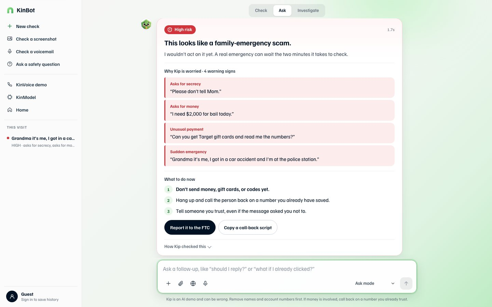

## 5. Let Kip investigate
Straight after the verdict, the investigator agent runs. It looks at every link, phone number, email address and crypto wallet in the message, using tools that only read:

| Check | What it does |
|---|---|
| **Website owner** | Who registered the domain and how old it is, brand look-alikes (e.g. `paypa1`), risky endings, link shorteners |
| **Phishing lists** | Looks the link up in the OpenPhish community feed |
| **Opened the link safely** | Fetches the page from AWS without running scripts, cookies or forms, and reports features such as password boxes and redirects, never the page text |
| **Phone number** | One-ring area codes (such as 876 in Jamaica), 900 numbers, toll-free and international numbers |
| **Scam advice** | Matching guidance from the FTC |

It shows its conclusion and a **Next step** first, then each check with a **Danger**, **Caution** or **Note** label. Open a row to see exactly what it found. Every finding comes from a tool, not from the model's imagination.

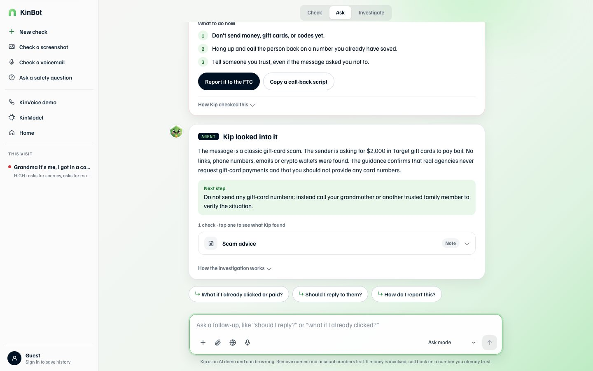

## 6. Ask a follow-up
Switch to **Ask mode** (or press a chip such as **Should I reply to them?**) and ask anything about staying safe. If you say you've already paid, or that it's happening right now, KinBot skips the model and shows fixed safety steps.

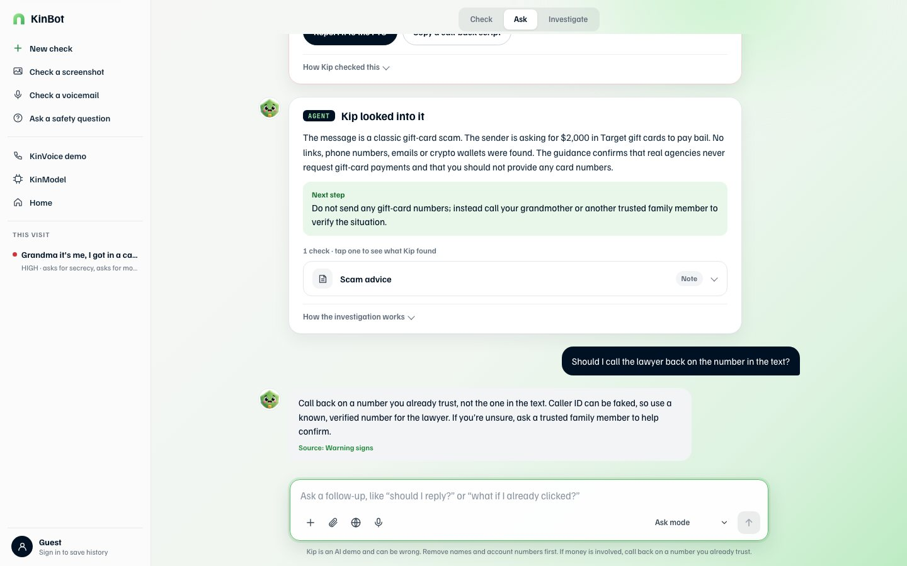

## 7. Check a screenshot
Press **Check a screenshot** in the sidebar, the paperclip, or **+** → *Check a screenshot*. Then pick an image, paste it with **Ctrl/Cmd+V**, or drag it onto the page. It appears in the composer; press send.

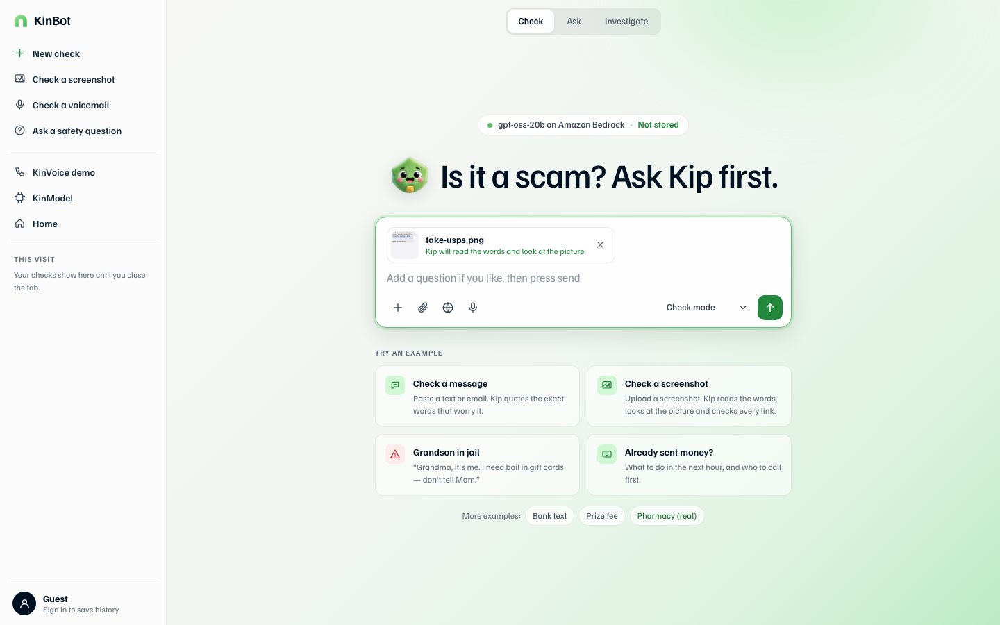

A vision model (Qwen3-VL on Amazon Bedrock) reads the picture: what it is, the brand it claims, any QR code, visual warning signs, and every word in it. Then the same check and investigation run. It takes about 8 seconds.

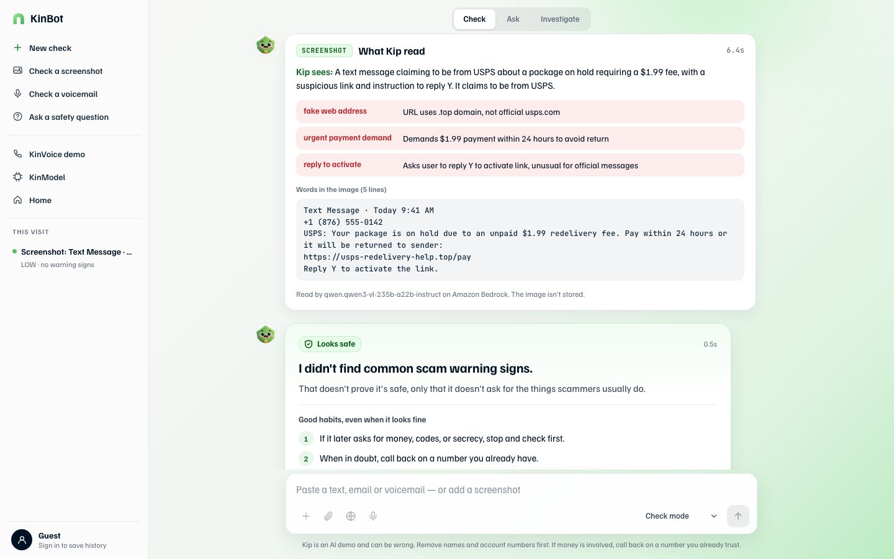

Text checks are tuned to family-emergency scams, so a delivery-fee text can look harmless as words alone. When the picture or the links tell a different story, **Kip's overall take** raises the verdict. It can raise the verdict, never lower it.

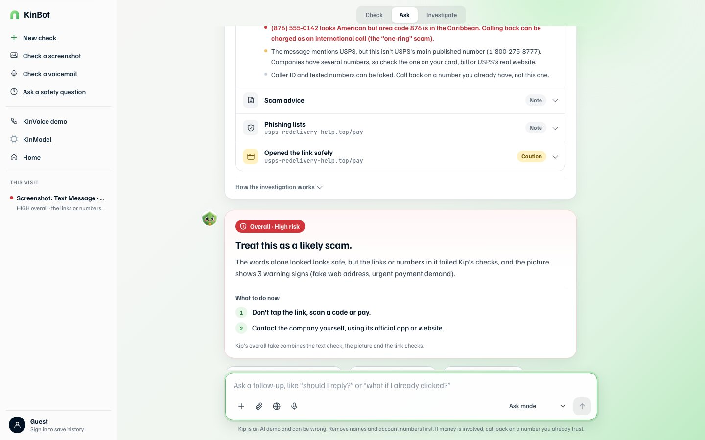

## 8. Check a voicemail
Press **Check a voicemail**, then upload a recording (MP3, M4A, WAV, OGG or WebM), or press the microphone to record up to about 2 minutes. An audio model (Voxtral on Amazon Bedrock) writes down exactly what was said, in the original language, then the same check runs. The audio isn't stored.

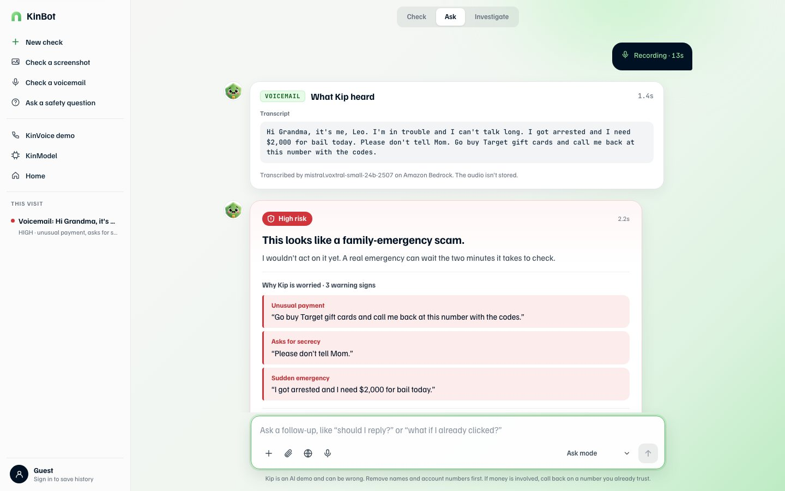

## 9. On a phone
On a phone the sidebar becomes a menu (☰) and everything else works the same, including screenshots and the microphone.

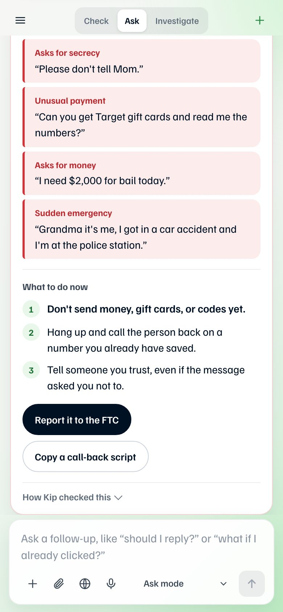

## 10. Sign in (optional)
Press **Sign in to save history** at the bottom of the sidebar. Sign-in uses email and a one-time code (Amazon Cognito). Once you're signed in:
- the sidebar shows **Your checks**;
- only the risk level, type, headline, score and date are saved, **never the message**, and they are deleted after 90 days;
- **Delete my history** and **Sign out** are in the account view.

## Privacy
Messages, screenshots and voicemails aren't logged or stored. Remove names and account numbers before you paste.

## Limits
- On our 46-message test set, the text check plus the agent caught 20 of 29 scams, with 1 false alarm on 17 real messages ([report](../../eval/kinbot/REPORT.md)). Delivery, toll and job-offer scams are the weak spot.
- The page fetch is a guarded static fetch, not a full browser.
- KinBot is an AI demo and can be wrong. If money is involved, call back on a number you already trust.
