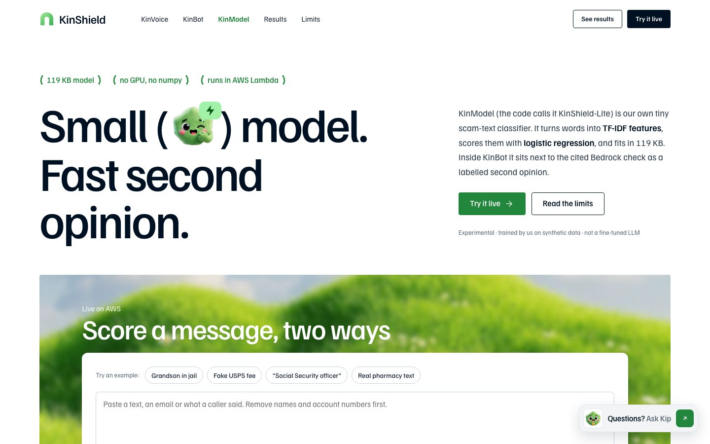
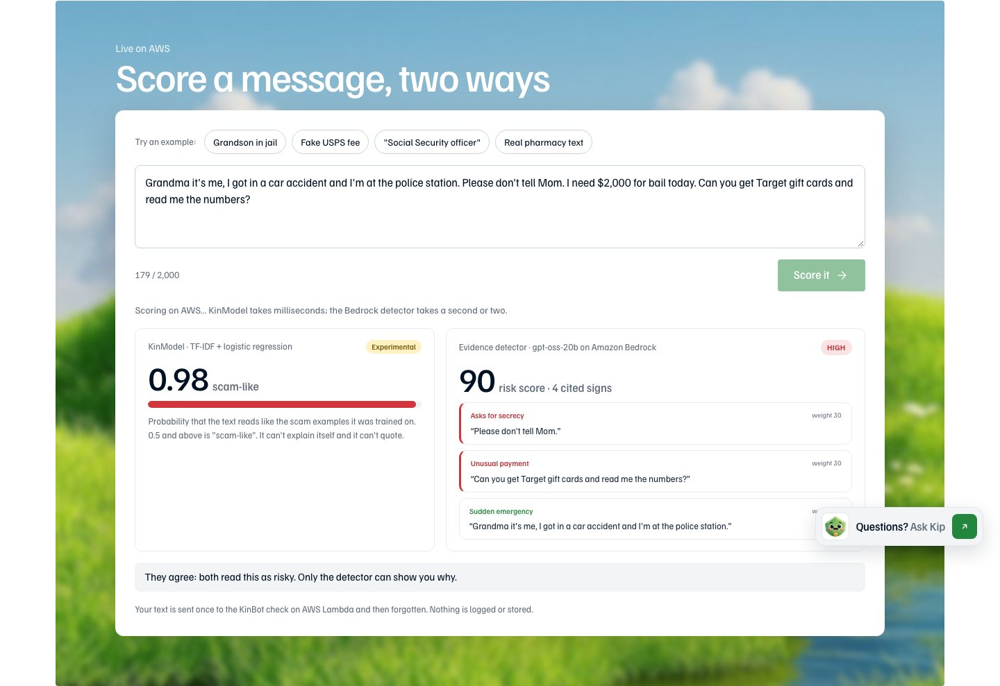

<h1 align="center">KinModel guide</h1>

<b>Small model. Fast second opinion.</b> 
<a href="https://kinshield.site/kinmodel.html">Open KinModel</a> · <a href="../../README.md">Back to the KinShield README</a>

---

KinModel is our own tiny scam classifier: a 119 KB TF-IDF + logistic-regression model, quantised to int8, that runs inside the AWS Lambda without calling any AI service. It sits next to the Bedrock detector as a **second opinion**. When the two disagree, you can see it.

## 1. Open the page
Go to **https://kinshield.site/kinmodel.html**. Press **Try it live**, or scroll to **Score a message, two ways**.

## 2. Score a message two ways
1. Paste a message (up to 2,000 characters) into the box, or press an example under **Try an example:** (**Grandson in jail**, **Fake USPS fee**, **"Social Security officer"** or **Real pharmacy text**).
2. Press **Score it**.
3. Read the two results:
   - **Left, KinModel:** a probability from 0 to 1 and *scam-like / not scam-like*. It answers in milliseconds.
   - **Right, the evidence detector** (gpt-oss-20b on Amazon Bedrock): a level, a score and the warning signs with their exact quotes.
4. The line underneath says whether they **agree**. Only the detector can show you *why*.

## 3. Read the rest of the page
- **How it works:** from words to a score in four steps (word and character n-grams, TF-IDF, logistic regression, int8 weights).
- **The numbers, and why to doubt them:** results on our benchmark, with the caveats.
- **We fine-tuned gpt-oss-20b, then shrank it again:** our QLoRA fine-tune on an NVIDIA DGX Spark and the distilled KinShield-Tiny v3. Both are research and aren't used by the live app. They're published on Hugging Face: [kinshield-20b](https://huggingface.co/Solomonwilsonr/kinshield-20b) and [kinshield-tiny-v3](https://huggingface.co/Solomonwilsonr/kinshield-tiny-v3).
- **Honest limits** and **Where KinModel is going**.

## Limits
- English text only, and keyword-driven: it can be fooled by unusual wording.
- Trained on 600 synthetic texts we generated, so its benchmark score is optimistic.
- It's a second opinion. It never overrides the detector.
