

<h1 align="center">KinVoice guide</h1>

<b>Watch a trusted call turn dangerous, turn by turn.</b> 
<a href="https://kinshield.site/kinvoice-app.html">Open KinVoice</a> · <a href="../../README.md">Back to the KinShield README</a>

---

KinVoice is a caregiver's view of a phone call. A scripted (or typed) call plays line by line, and after every caller line Amazon Bedrock re-reads the whole conversation so far and scores it against seven warning signs. You see the risk climb, the exact words that raised it, and what to do next.

**What's real and what's simulated:** the scoring is real and live (gpt-oss-20b on Amazon Bedrock). The phone call, the push alert and "Verify with family" are simulated in the browser, and the page says so.

**You need:** a browser. No account, no install, no phone call. Works on phones too.

## 1. Open the product page
Go to **https://kinshield.site/kinvoice.html**. The page explains KinVoice and shows a frozen preview of a real scored call. Press **Try scam call** or **Open the app** to start.

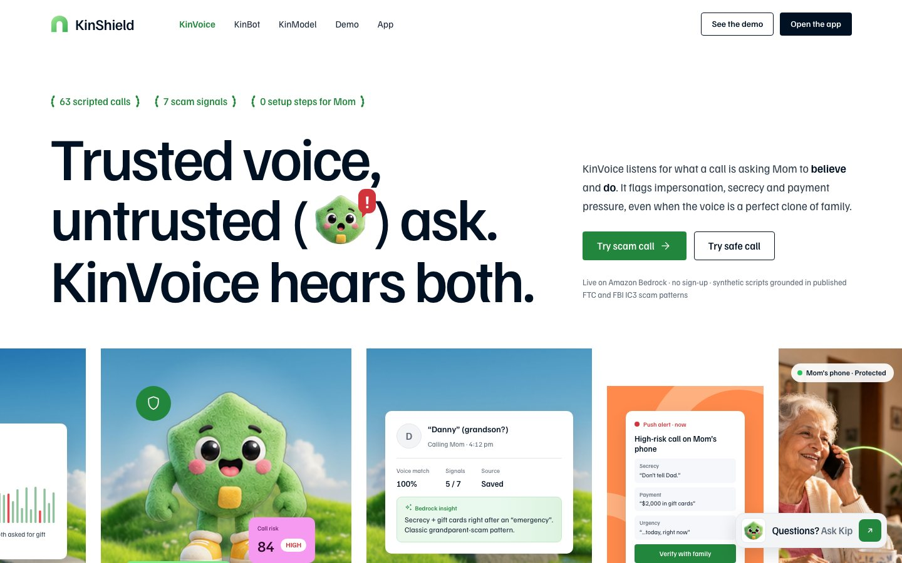

## 2. Choose a call
The app opens on the **Calls** tab with all 63 scripted calls (31 scams, 32 safe calls written from published FTC and FBI IC3 patterns).

- Type in **Search calls** (for example "gift card" or "bank"), or filter with **Scam / Safe / All**.
- The **Start here** cards pick a good first call for you.
- In the sidebar, **Random scam call** always picks a scam that reliably scores High, and **Random safe call** picks an ordinary call.

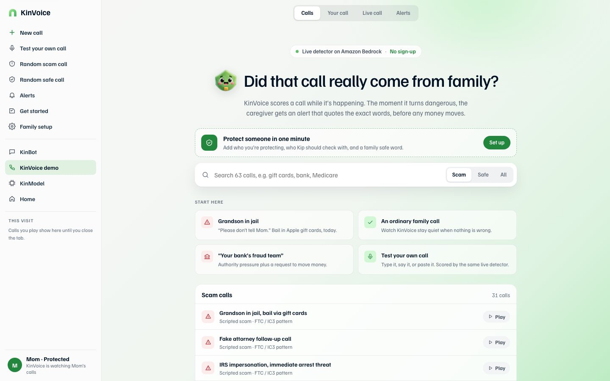

## 3. (Optional) Set up your family
Press **Family setup** in the sidebar (or **Set up** on the green card). In three short steps, enter:
1. who you're protecting (default "Mom") and your name as the caregiver;
2. up to three trusted contacts, the people KinVoice should check with;
3. your alert level (High only, or Medium and above) and an optional family safe word.

Everything is saved only in your browser. The names then appear throughout the demo.

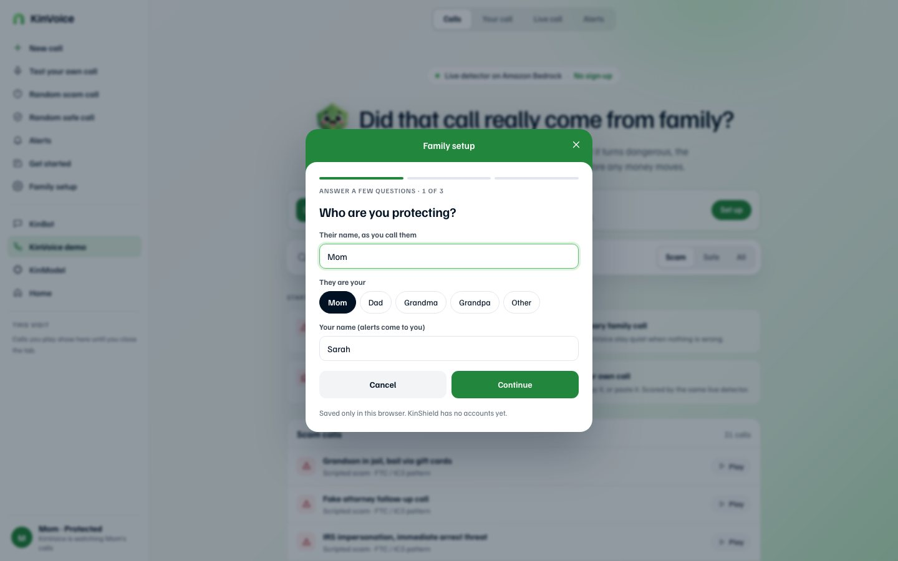

## 4. Watch the call
Press **Play** on a call. The **Live call** tab opens:

- **Left:** the transcript, one line at a time.
- **Right:** the risk score and the **risk timeline**. Each dot is a point where Bedrock scored the call (up to 6 per call). Dashed lines mark Medium (25) and High (60).
- The first line, "Grandma? Grandma, it's me.", scores **0**. A greeting alone isn't a warning. The score only rises as the warning signs add up.

When the score crosses your alert level, a **push alert** pops up in the top-right while the call is still going, quoting the line that tipped it. Press **Verify now** or **Keep listening**.

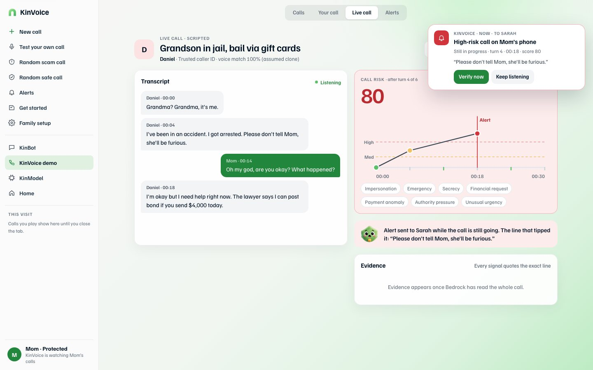

## 5. Read the alert
When the call ends on Medium or High, the full alert opens. It shows the recommended action and the **three strongest warning signs, each with the exact words** the caller used. You can **Verify with family**, **Create a fraud report**, or **Dismiss**.

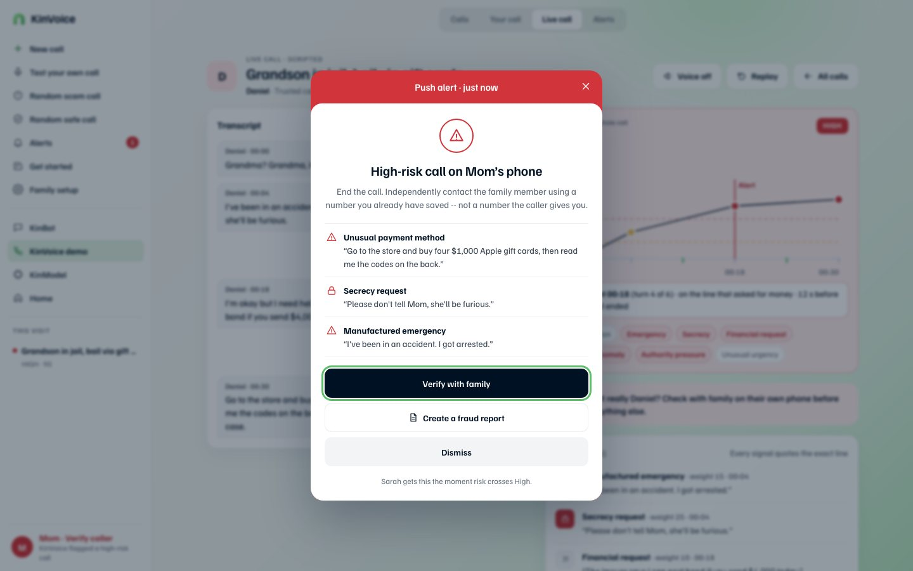

## 6. Review the result
Dismiss the alert to see the full result:
- the final score and level;
- a lead line such as *"Alert at 00:18 (turn 4 of 6) · on the line that asked for money · 12 s before the call ended"*;
- the seven signal chips, with the ones that fired highlighted;
- **Evidence**: every sign with its weight, timestamp and the exact quote;
- Kip's advice, and buttons for **Verify with family**, **Fraud report** and **Mark safe**.

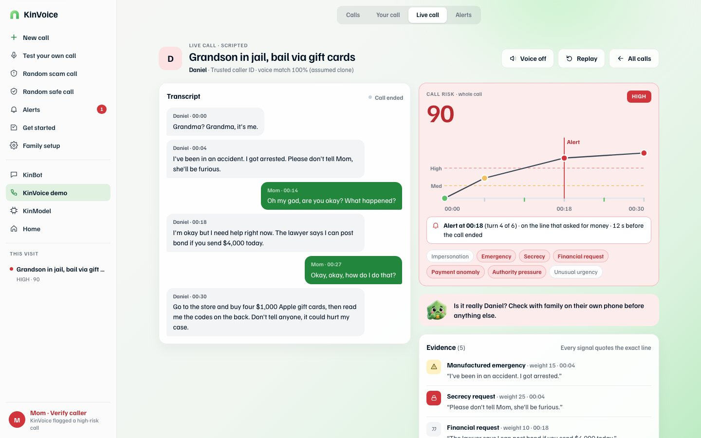

## 7. Verify with family
Press **Verify with family**. KinVoice asks who to check with: the person the caller claimed to be if they're one of your trusted contacts, or someone you pick.

1. **Swipe to ping** (or press the arrow). The ping goes to *that person's own phone*, not the number that called.

   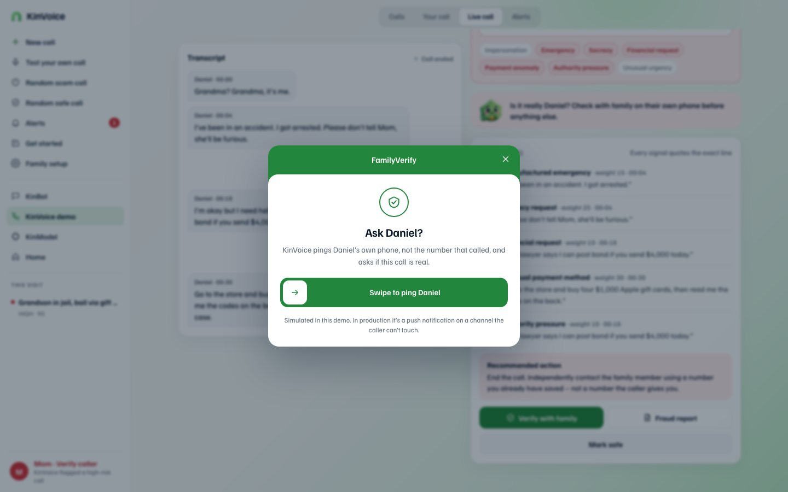

2. On "their" phone, answer the question. In the demo you answer for them: **No, it wasn't me** or **Yes, it was me**.

   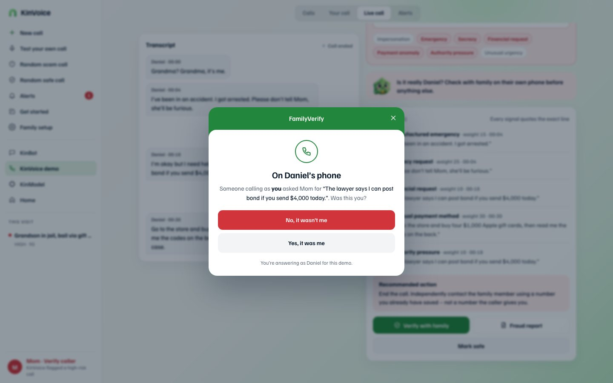

3. "No" shows **Caller not verified**: tell your parent to hang up and send nothing. "Yes" puts the phone back to Protected.

   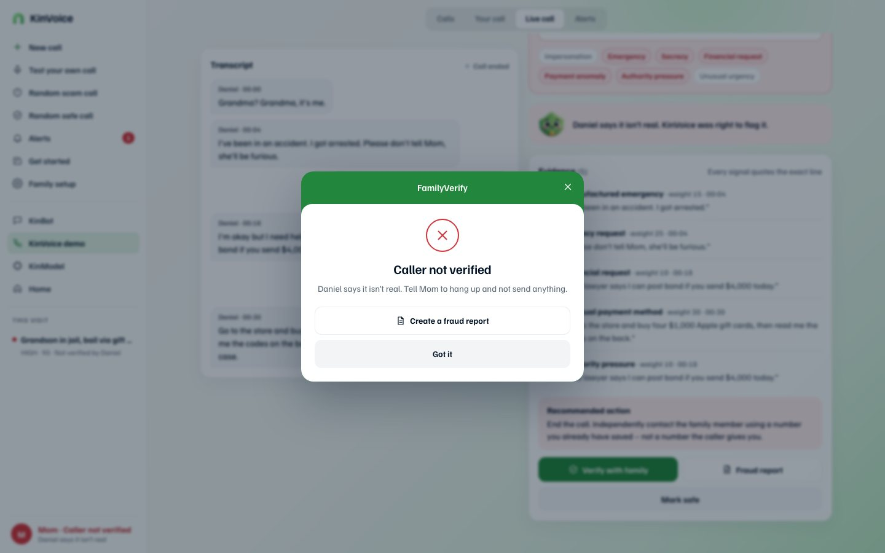

## 8. Make a fraud report
Press **Fraud report** (or **Create a fraud report** on the alert). The report lists the caller's claim, the likely scam type, every money request with its time, every quoted warning sign and the full transcript, with links to the **FTC**, **FBI IC3** and the **DOJ Elder Fraud Hotline (1-833-372-8311)**. Press **Copy report** or **Download .txt**. Reports from scripted calls are marked "practice only".

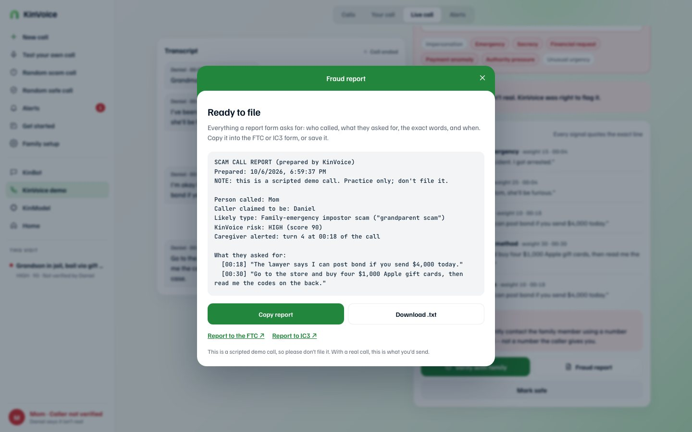

## 9. Test your own call
Open the **Your call** tab (or **Test your own call** in the sidebar, or `kinvoice-app.html?own=1`).

1. Optionally fill in **The caller says they are** (for example "Daniel, your grandson"), or load a call to edit from **Start from a scripted call**.
2. Add lines one at a time: choose **Caller** or the protected person, type the line, and press **Add line**. Or press the microphone to speak it (Chrome, Edge or Safari).
3. Or open **Paste a whole conversation** and paste lines like `Caller: It's me, I'm in trouble`.
4. Press **Run through KinVoice**. Your call plays and scores exactly like a scripted one.

Your lines are sent to Amazon Bedrock to be scored and aren't stored. Leave out real names and account numbers.

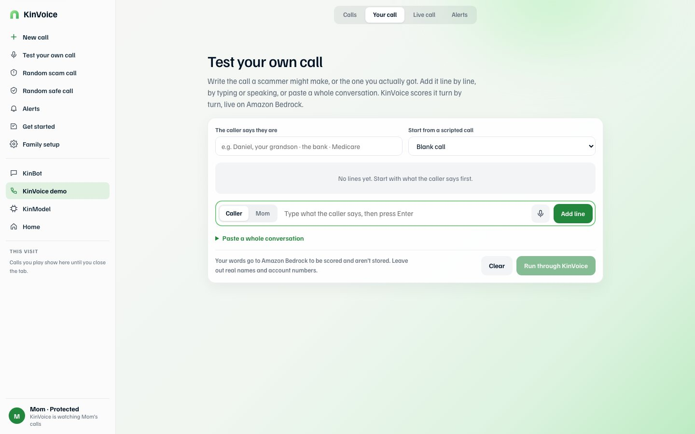

## 10. More controls
- **Voice off / on:** Amazon Polly reads the caller's lines aloud while your browser reads the other side.
- **Replay:** plays the same call again. Scores for scripted calls are cached for the visit, so replays are instant and free.
- **Alerts** tab: every alert from this visit.
- **This visit** in the sidebar: every call you played and its result.
- **Get started:** a checklist that walks you through scam call → alert → verify → report → your own call → family setup.

## Try these calls
| Call | What to expect |
|---|---|
| Grandson in jail, bail via gift cards (`?id=scam_001`) | High; alert at turn 4, on the line asking for money |
| A "don't tell Dad, it's a surprise party" call | Stays Low: a secret on its own isn't a scam |
| A real $100 loan for a plumber | Stays Low: a money request from someone familiar, with no pressure |
| An IRS impersonation with an immediate-arrest threat | High: authority pressure plus urgency and an unusual payment |

## Limits
- KinVoice reads text, not live audio. It hasn't been tested on real calls, accents or noisy audio.
- The 63 calls were written by us. On them, the live detector flagged 29 of 31 scams and none of the 32 safe calls ([results](../../benchmark/RESULTS.md)).
- Push alerts, FamilyVerify and the location check are simulated.
